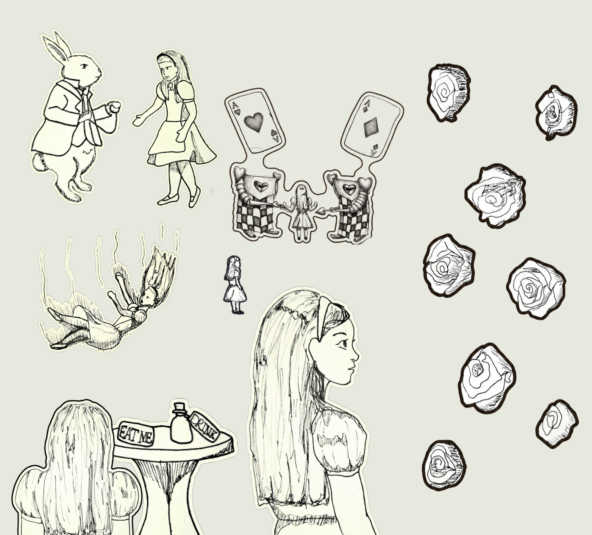
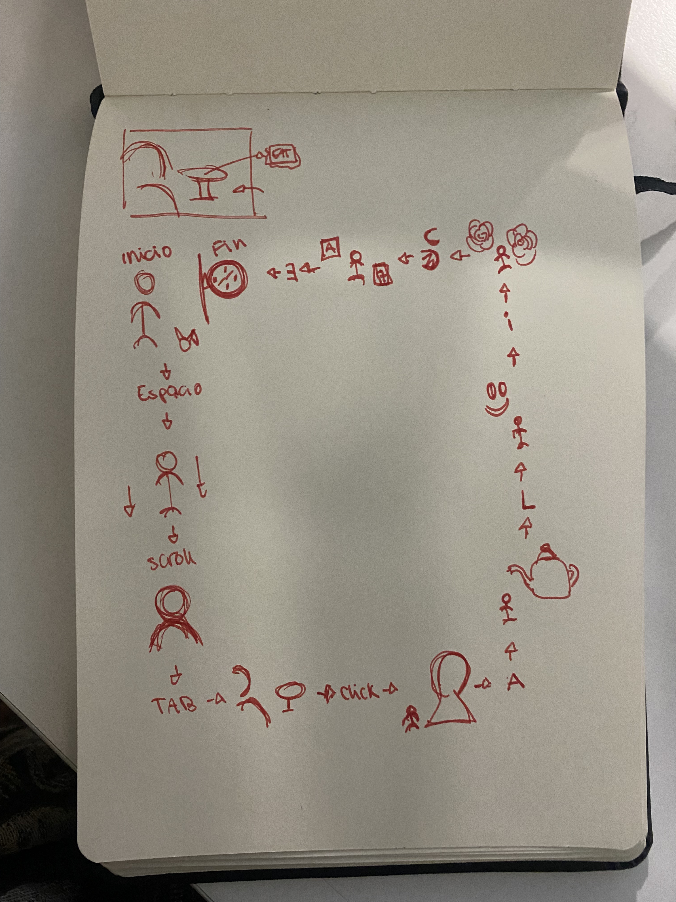

## Link web pública
[Link web](https://dezcontinuado.github.io/Examen-Pensamiento-Computacional/)
### Título del proyecto

"ALICE EN EL EXAMEN"

### Referencia de origen/ bibliografía

Alice in Wonderland - Walt Disney Productions, 1951

Direccion: Clyde Geronimi, Wilfred Jackson y Hamilton Luske.

### Imagen de referencia de proyecto




### Integrantes 

Romina Inostroza. [dezcontinuado](https://github.com/Dezcontinuado)

José Bravo. [Eiivor07](https://github.com/Eiivor07)

Renata Danyan. [rreniss](https://github.com/rreniss)

### Enlace p5.js

[p5js](https://editor.p5js.org/josebravogranja2007/sketches/fAS948Mqs)

### Relato inicial

El proyecto consiste en una reinterpretación interactiva de la película Alicia en el país de las 
maravillas (1951), donde el usuario avanzará por distintas escenas mediante una serie de interacciones.
El proyecto comienza con Alicia junto al Conejo blanco, mientras este atraviesa la pantalla. Cuando 
el conejo desaparece el usuario debe presiona la "Barra espaciadora" para inciar la caída de Alicia.
Cuado finalice la caída, el usuario deberá utilizar el "Scroll" para iniciar la siguiente
escena, en la que Alicia crece y aparece de espaldas junto a una mesa. Después al presionar 
la tecla "TAB" Alicia se hace pequeña y la mesa desaparece. Continuamos haciendo "CLcik", lo que
genera un cerrojo grande en la escena.

Nuestro proyecto continua utilizando las letras que forman el nombre "ALICE", la letras "A" genera
la escena donde Alicia se encuentra con tazas y teteras a su alrededor, seguido de la letras "L" 
que hace aparecer al gato sonriente, este aparece y desaparece en distintos lugares del
canva. Seguimos con la letras "I" que genera el escenario de Alicia en el jardín de rosas rojas
y blancas. Luego la letra "C" introduce las cartas de la reina de corazones, que van rodeando a Alicia.
Y para finalizar nuestro proyecto, presionamos la letras "E" la cual introduce el reloj del Conejo 
blanco cerrando el recorrido por escenas icónicas de la película.


### Storyboard



### Estados 

#### Estado 1

En el primer estado Alicia observa al Conejo blanco pasar frente a ella.

Al apretar la barra espaciadora, alicia empieza a caer.

```js
function dibujarEtapa1() {
 dibujarAlicia(aliciaX, aliciaY, 250, "frente");
 //pregunta si el conejo au no atraveso la pantalla
 if (conejoX < width + 100) {
 conejoX += 4; // si es verdad lo mueve, este sirve para el
desplazamiento del conejo y su velocidad
 dibujarConejo(conejoX, conejoY);
} else {
 mostrarTextoIndicador("Presiona ESPACIO", width / 2, 50);
  }
 } function keyPressed() {
 if (etapa === 1 && keyCode === 32 && conejoX >= width + 100) {
inicializarEtapa(2); }
 }
```

#### Estado 2

Cuando la caída termina el usuario deberá hacer "Scroll", 
lo que muestra una Alicia grande e inicia el siguiente estado.

```js
function dibujarEtapa2() {
 dibujarAlicia(aliciaX, aliciaY, 250, "caida");
if (aliciaY < height + 100) {
mostrarTextoIndicador("Usa la RUEDA DEL MOUSE (Scroll) para caer", width / 2, 50);
 } else {
inicializarEtapa(3);
 }
}
function mouseWheel(event) {
if (etapa === 2) {
if (event.delta > 0) {
aliciaY += 15;
}
return false;
 }
}

```

#### Estado 3

Alicia grande aparece frente a una mesa, ambos elementos se desplazan hasta su 
posición final.  

Al apretar "TAB" Alicia se hace pequeña y la mesa desaparece.

```js
function dibujarEtapa3() {
if (aliciaX > width * 0.35) aliciaX -= 2;
 if (mesaX < width * 0.65) mesaX += 3.5;
dibujarMesa(mesaX, mesaY, 200);
dibujarAlicia(aliciaX, aliciaY, aliciaW, "espalda");

if (aliciaX <= width * 0.35 && mesaX >= width * 0.65) {
 mostrarTextoIndicador("Presiona TAB", width / 2, 50);
 }
}
else if (etapa === 3 && keyCode === TAB && aliciaX <= width * 0.36 && mesaX >= width * 0.64) {
 inicializarEtapa(4);
return false;

```

#### Estado 4

La mesa desaparece de la pantalla y cuando esto ocurre hay que presionar "Click".

Lo que genera el cambio de escena y aparece el cerrojo.

```js
function dibujarEtapa4() {

if (mesaX < width + 200) {
 mesaX += 5;
} else {
 mostrarTextoIndicador("Presiona CLICK en la pantalla", width / 2, 50);
}
 dibujarMesa(mesaX, mesaY, 200);
dibujarAlicia(aliciaX, height * 0.65, aliciaW, "perfil");
 }

function mousePressed() {
if (etapa === 4 && mesaX >= width + 190) {
 inicializarEtapa(5);
 }
}

```

#### Estado 5

Alicia aparece frente al cerrojo y es pequeña.

Presionar la letra "A" aparecen las tazas y teteras.

```js
function dibujarEtapa5() {
 dibujarAlicia(aliciaX, aliciaY, 180, "chica");

if (cerrojoY < height * 0.5) {
 cerrojoY += 3;
} else {
 mostrarTextoIndicador("Presiona A", width / 2, 50);
}
 dibujarCerrojo(width * 0.6, cerrojoY, 300);
}
else if (etapa === 5 && (key === 'A' || key === 'a') && cerrojoY >= height * 0.49) {
inicializarEtapa(6);
 }


```

#### Estado 6

Las tazas y teteras se desplazan horizontalmente por la pantalla hasta desaparecer.

Presionar "L" da inicio a la escena del gato

```js
function dibujarEtapa6() {
 dibujarAlicia(aliciaX, aliciaY, 180, "chica");

let todosFuera = true;

for (let item of elementosTe) {
 item.x += item.velocidad;

if (item.tipo === 'tetera') {
  image(imgTetera, item.x, item.y, 60, 60);
 } else {
  image(imgTaza, item.x, item.y, 45, 45);
}
 if (item.x < width + 50) todosFuera = false;
 }

if (todosFuera) {
 mostrarTextoIndicador("Presiona L", width / 2, 50);
 }
}
else if (etapa === 6 && (key === 'L' || key === 'l')) {
 let listos = true;
 for(let item of elementosTe) {
  if(item.x < width + 50) listos = false;
}

if(listos) inicializarEtapa(7);
 }

```

#### Estado 7

EL gato sonriente aparece y desaparece en distintas partes de la pantalla.

Presionar "I" lo que da inicio a la escena de las rosas

```js
function dibujarEtapa7() {
 dibujarAlicia(aliciaX, aliciaY, 180, "chica");

if (gatoContador < 10) {
 gatoTimer += deltaTime;

gatoAlpha = sin(map(gatoTimer, 0, 1500, 0, PI)) * 255;

push();
 tint(255, gatoAlpha);
image(imgGato, gatoX, gatoY, 120, 120);
 pop();

if (gatoTimer >= 1500) {
gatoTimer = 0;
gatoContador++;
 cambiarGatoPosicion();
 }
} else {
 mostrarTextoIndicador("Presiona I", width / 2, 50);
 }
}

else if (etapa === 7 && (key === 'I' || key === 'i') && gatoContador >= 10) {
 inicializarEtapa(8);
}

```

#### Estado 8

Aparecen rosas rosas y blancas alrededor de Alicia.

Presionar "C" para que aparezcan las cartas.

```js
function dibujarEtapa8() {

for(let r of rosas) {
 push();
 translate(r.x, r.y);
 r.rot += r.velRot;
 rotate(r.rot);
dibujarRosa(0, 0, 60, r.tipo);
pop();
}

dibujarAlicia(aliciaX, aliciaY, 180, "chica");

if (millis() - rosasTimer > 10000) {
 mostrarTextoIndicador("Presiona C", width / 2, 50);
 }
}

else if (etapa === 8 && (key === 'C' || key === 'c') && (millis() - rosasTimer > 10000)) {
 inicializarEtapa(9);
}
```

#### Estado 9

Las cartas avanzan desde los extramos de la pantalla hasta llegar a alicia.

Presionar "E" para finalizar el proyecto con la aparición del reloj del Conejo blanco.

```js
function dibujarEtapa9() {
 dibujarGuardias(width / 2, height / 2, 750);

mostrarTextoIndicador("Presiona E", width / 2, 50);
}

else if (etapa === 9 && (key === 'E' || key === 'e')) {
  inicializarEtapa(10);
}

```
